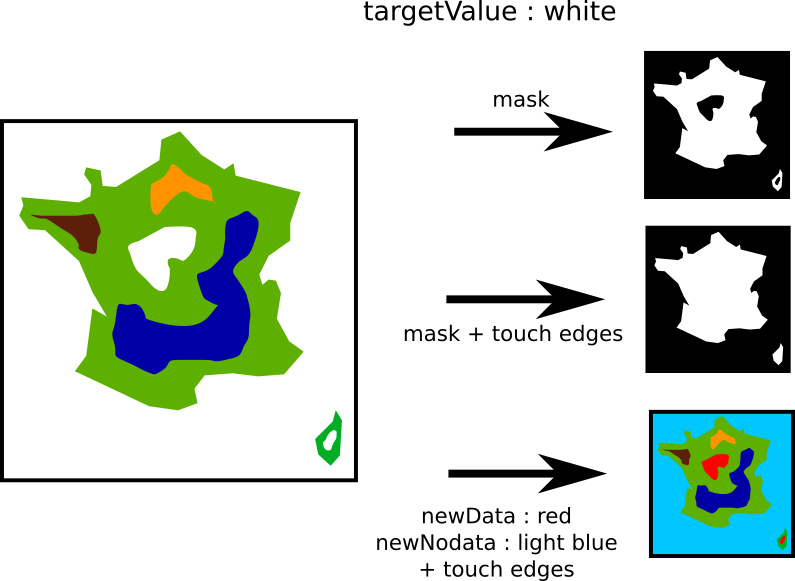
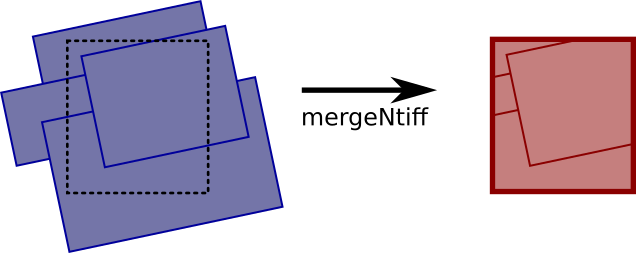
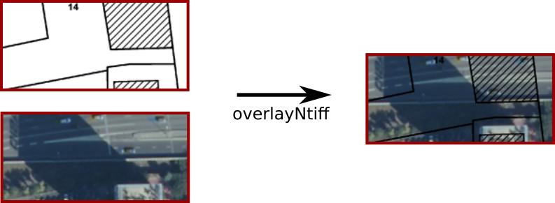

La suite d'outils ROK4GENERATION permet de générer, mettre à jour, composer, supprimer ou extraire des pyramide raster ou vecteur. Ces outils sont écrits en Perl. Le travail de génération peut nécessiter l'utilisation d'outils de traitement d'images (réechantillonnage, reprojection, décimation, composition) écrits en C++.

<!-- TOC START min:1 max:3 link:true update:true -->
- [Outils principaux](#outils-principaux)
    - [Génération de pyramide raster](#génération-de-pyramide-raster)
        - [La suite BE4](#la-suite-be4)
        - [La suite JOINCACHE](#la-suite-joincache)
    - [Génération de pyramide à la demande](#génération-de-pyramide-à-la-demande)
    - [Génération de pyramide vecteur](#génération-de-pyramide-vecteur)
        - [La suite 4ALAMO](#la-suite-4alamo)
    - [Gestion des pyramides](#gestion-des-pyramides)
        - [Suppression de pyramide](#suppression-de-pyramide)
        - [Extraction de pyramide](#extraction-de-pyramide)
        - [Transfert de pyramide](#transfert-de-pyramide)
    - [Les outils de débogage](#les-outils-de-débogage)
        - [Simulation des dalles à générer](#simulation-des-dalles-à-générer)
        - [Création d'un descripteur de couche](#création-dun-descripteur-de-couche)
        - [Création du fichier liste d'une pyramide](#création-du-fichier-liste-dune-pyramide)
        - [Identification d'une dalle à partir de coordonnées](#identification-dune-dalle-à-partir-de-coordonnées)
        - [Interface de conversions diverses](#interface-de-conversions-diverses)
- [Outils de manipulation](#outils-de-manipulation)
    - [Manipulation raster](#manipulation-raster)
        - [Passage au format de travail d'une dalle ROK4](#passage-au-format-de-travail-dune-dalle-rok4)
        - [Fusion d'un dallage d'images](#fusion-dun-dallage-dimages)
        - [Décimation d'une image](#décimation-dune-image)
        - [Gestion du nodata](#gestion-du-nodata)
        - [Sous réechantillonnage de 4 images](#sous-réechantillonnage-de-4-images)
        - [Réechantillonnage et reprojection d'images](#réechantillonnage-et-reprojection-dimages)
        - [Superposition d'images](#superposition-dimages)
        - [Stockage final en tuiles indépendantes](#stockage-final-en-tuiles-indépendantes)
        - [Stockage final en dalle](#stockage-final-en-dalle)
    - [Manipulation vecteur](#manipulation-vecteur)
        - [Écriture d'une dalle vecteur](#écriture-dune-dalle-vecteur)

<!-- TOC END -->

# Outils principaux

Écrits en Perl.

Quand un outil est dit parallélisable, c'est qu'il identifie le travail à faire, le partage équitablement et écrit les scripts Shell (nombre configurable). C'est alors l'exécution de ces scripts qui fait réellement le travail (calcul de dalles, copie de pyramide...).

## Génération de pyramide raster

### La suite BE4

Outils : `be4-file.pl`, `be4-ceph.pl`, `be4-s3.pl`, `be4-swift.pl`

Les outils BE4 génèrent une pyramide raster à partir d'images géoréférencées ou d'un service WMS. Ils permettent de mettre à jour une pyramide raster existante. Si des images sont en entrée, elles peuvent être converties à la volée dans le format de la pyramide en sortie.

Stockage gérés : FICHIER, CEPH, S3, SWIFT

Parallélisable.

Outils internes utilisés :
* cache2work
* composeNtiff
* decimateNtiff
* merge4tiff
* mergeNtiff
* work2cache

Outils externes utilisés :
* gdalinfo
* wget

_Étape 1_

_Étape 2 (QTree)_

_Étape 2 (NNGraph)_

[Détails](./main/bin/be4.md)

### La suite JOINCACHE

Outils : `joinCache-file.pl`, `joinCache-ceph.pl`, `joinCache-s3.pl`

Les outils JOINCACHE génèrent une pyramide raster à partir d'autres pyramide raster compatibles (même TMS, dalles de même dimensions, canaux au même format). La composition se fait verticalement (choix des pyramides sources par niveau) et horizontalement (choix des pyramides source par zone au sein d'un niveau). La fusion de plusieurs dalles sources peut se faire selon plusieurs méthodes (masque, alpha top, multiplication)

Stockage gérés : FICHIER, CEPH, S3

Parallélisable.

Outils internes utilisés :
* cache2work
* overlayNtiff
* work2cache

_Étape 1_

_Étape 2_

[Détails](./main/bin/joincache.md)

## Génération de pyramide à la demande

Outil : `wmtSalaD.pl`

Une pyramide à la demande ne contient pas de données à la génération. Cela consiste en un simple descripteur de pyramide renseignant les sources à utiliser pour répondre aux requêtes WMTS.

## Génération de pyramide vecteur

### La suite 4ALAMO

Outils : `4alamo-file.pl`, `4alamo-ceph.pl`

Les outils 4ALAMO génèrent une pyramide vecteur à partir d'une base de données PostgreSQL. Ils permettent de mettre à jour une pyramide vecteur existante.

Stockage gérés : FICHIER, CEPH

Parallélisable.

Outils internes utilisés :
* cache2work
* pbf2cache

Outils externes utilisés :
* ogr2ogr
* tippecanoe

_Étape 1_

_Étape 2_

[Détails](./main/bin/4alamo.md)

## Gestion des pyramides

### Suppression de pyramide

Outil : `sup-pyr.pl`

Cet outil supprime une pyramide à partir de son descripteur. Pour une pyramide stockée en fichier, il suffit de supprimer le dossier des données. Dans le cas de stockage objet, le fichier liste est parcouru et les dalles sont supprimées une par une.

Stockage gérés : FICHIER, CEPH, S3, SWIFT

### Extraction de pyramide

Outil : `ex-pyr.pl`

Cet outil génère une pyramide fichier par extraction géographique de pyramides sources. Il est possible de préciser des pyramides différentes pour chaque niveau.

Stockage gérés : FICHIER, CEPH, S3, SWIFT

Type de pyramide : raster

### Transfert de pyramide

Outil : `pyr2pyr.pl`

Cet outil copie une pyramide d'un stockage à un autre.

Stockage géré en entrée : FICHIER
Stockages gérés en sortie : CEPH, S3, SWIFT

Parallélisable.

## Les outils de débogage

### Simulation des dalles à générer

Outil : `be4-simulator.pl`

À partir d'un TileMatrixSet et d'une géométrie (fournie en WKT dans un fichier), cet outil calcule les dalles à générer par niveau et peut en imprimer la liste. Cela permet de quantifier le travail qu'une génération BE4 aurait à faire. Le fichier listant les dalles est utilisable par BE4 comme définition de l'étendue à générer (à la place de extent dans la configuration des datasources).

### Création d'un descripteur de couche

Outil : `create-layer.pl`

Cet outil génère un descripteur de couche pour ROK4SERVER à partir du descripteur de pyramide et du dossier des TileMatrixSets. Il est basique (titre, nom de couche, résumé par défaut) mais fonctionnel. La couche utilisera alors la pyramide en entrée dans sa globalité.

### Création du fichier liste d'une pyramide

Outil : `create-list.pl`

Cet outil génère le fichier liste pour une pyramide qui n'en aurait pas, à partir du dossier des données.

Stockage géré : FICHIER

### Identification d'une dalle à partir de coordonnées

Outil : `coord2image.pl`

Ce outil détermine le chemin de la dalle fichier contenant le point renseigné par ses coordonnées. On précise le nombre de tuiles dans une dalle et le niveau de la pyramide voulu.

Stockage géré : FICHIER

### Interface de conversions diverses

Outil : `tms-converter-gui.pl`

Cet outil propose plusieurs conversions entre requêtes WMS/WMTS, coordonnées, chemin de dalles fichier...

# Outils de manipulation

Écrits en C++.

Plus de détails dans les dossiers des outils.

Voici la légende utilisée pour identifié le format des images dans les documentations par commande :

## Manipulation raster

### Passage au format de travail d'une dalle ROK4

Outil : `cache2work`

Cet outil transforme une dalle ROK4 raster en une image TIFF de même dimension mais non tuilée et potentiellement non compressée. Il est utilisé lorsque l'on veut retravailler une dalle d'une pyramide.

   

### Fusion d'un dallage d'images

Outil : `composeNtiff`

Cet outil fusionne plusieurs images disposées en un dallage régulier en une seule. Il est utilisé lorsqu'une image est moissonnée en plusieurs fois à cause de sa taille, pour recomposer l'image désirée.

### Décimation d'une image

Outil : `decimateNtiff`

Cet outil génère une image à partir de plusieurs image en phase entre elles (même résolution et même décalage) en ne gardant qu'un pixel sur N. Cet outil est utilisé pour générer une dalle d'un niveau à partir de dalles d'un niveau inférieur dans le cas d'une pyramide utilisant un TileMatrixSet "plus proche voisin" (une valeur de la donnée source n'est pas interpolée et se retrouve dans les niveaux supérieurs).

### Gestion du nodata

Outil : `manageNodata`

Cet outil permet d'identifier et de modifier une couleur dans une image considérée comme du nodata. Il permet également d'écrire le masque associé à l'image sur la base de cette valeur de nodata, et de réserver cette valeur au nodata (modification des pixels de données de cette couleur en une autre).

### Sous réechantillonnage de 4 images

Outil : `merge4tiff`

Cet outil génère une image à partir 4 images de même dimension disposées en carré, en moyennant les pixels 4 par 4. L'image en sortie a les dimensions des images en entrée. Il est possible de préciser une valeur de gamma pour exagérer les contrastes. Cet outil est utilisé pour générer une dalle d'un niveau à partir du niveau inférieur dans le cas d'une pyramide utilisant un TileMatrixSet de type Quad Tree.

### Réechantillonnage et reprojection d'images

Outil : `mergeNtiff`

Cet outil génère une image, définie par son rectangle englobant, sa projection et la résolution pixel, à partir d'images géoréférencées. Ces dernières peuvent avoir des projections et des résolutions différentes. Si le nombre de canaux n'est pas le même entre les sources et la sortie, la conversion est fait à la volée. Cet outil est utilisé pour générer le niveau le mieux résolu dans une pyramide à partir des images en entrée.

### Superposition d'images

Outil : `overlayNtiff`

Cet outil génère une image à partir de plusieurs images de même dimension par superposition. Le calcul est fait pixel par pixel à partir de ceux sources avec le choix du mode : par transparence, par multiplication, en tenant compte des masques associés... Cet outil est utilisé lors de générations JOINCACHE lorsque plusieurs dalles de différentes pyramides sont trouvées pour une même dalle en sortie.

### Stockage final en tuiles indépendantes

Outil : `slab2tiles`

Cet outil stocke une dalle de travail en tuiles indépendantes au lieu d'une seule dalle tuilée. Cet outil n'est disponible qu'avec un stockage Ceph.

### Stockage final en dalle

Outil : `work2cache`

Cet outil génère une dalle au format ROK4 à partir d'une image au format de travail. Une dalle ROK4 est une image TIFF dont les données sont tuilées, et avec un en-tête de taille fixe (2048 octets).

## Manipulation vecteur

### Écriture d'une dalle vecteur

Outil : `pbf2cache`

Cet outil écrit une dalle à partir des tuiles PBF rangées par coordonnées (<dossier racine>/x/y.pbf). La dalle écrite est au format ROK4, c'est-à-dire un fichier TIFF, dont les données sont tuilées : le TIFF ne sert que de conteneurs pour regrouper les tuiles PBF. L'en-tête est de taille fixe (2048 octets).

[Détails](./tools/pbf2cache/README.md)
