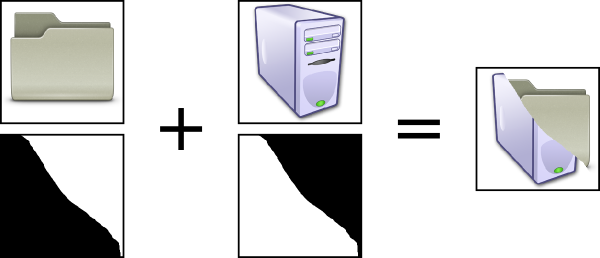

# OVERLAYNTIFF

[Vue générale](../../README.md#superposition-dimages)


Cet outil génère une image à partir de plusieurs images de même dimension et format de canal (entier non signé sur 8 bits ou flottant sur 32 bits) par superposition. Le calcul est fait pixel par pixel à partir de ceux sources avec le choix du mode : par transparence, par multiplication, en tenant compte des masques associés... Cet outil est utilisé lors de générations JOINCACHE lorsque plusieurs dalles de différentes pyramides sont trouvées pour une même dalle en sortie. Les images en entrée peuvent avoir un nombre de canaux différent.

## Usage

`overlayNtiff -f <FILE> -m <VAL> -c <VAL> -s <VAL> -p <VAL [-n <VAL>] -b <VAL>`

* `-f <FILE>` : fichier de configuration contenant l'image en sortie et la liste des images en entrée, avec les masques éventuels
* `-m <METHOD>` : méthode de fusion des pixels (toutes tiennent compte des éventuels masques) :
    * `ALPHATOP` : fusion par alpha blending

    * `MULTIPLY` : fusion par multiplication des valeurs des canaux

    * `TOP` : seul le pixel de donnée du dessus est pris en compte

* `-b <COLOR>` : couleur de fond, valeurs décimales pour chaque canal, séparées par des virgules (exemple : 255,255,255 pour du blanc sans transparence)
* `-t <COLOR>` : couleur à considérer comme transparente, valeurs décimales pour chaque canal, séparées par des virgules
* `-c <COMPRESSION>` : compression des données dans l'image TIFF en sortie : jpg, raw (défaut), zip, lzw, pkb
* `-s <INTEGER>` : nombre de canaux : 1, 2, 3, 4
* `-p <PHOTOMETRIC>` : photométrie : gray, rgb
* `-d` : activation des logs de niveau DEBUG

### Le fichier de configuration

Une ligne du fichier de configuration a la forme suivante : `<CHEMIN DE L'IMAGE> [<CHEMIN DU MASQUE ASSOCIÉ>]`.

La première image listée sera la sortie (avec éventuellement son masque). Les suivantes sont les images en entrée. L'ordre a de l'importance, les premières images sources seront considérées comme allant en dessous, quelque soit la méthode utilisée pour la fusion.

Exemple de configuration :
```
/home/IGN/IMAGE.tif  /home/IGN/MASK.tif
/home/IGN/sources/imagefond.tif
/home/IGN/sources/image1.tif
/home/IGN/sources/image2.tif /home/IGN/sources/mask2.tif
```

L'image `/home/IGN/IMAGE.tif` sera écrite ainsi que son masque associé `/home/IGN/MASK.tif`

## Exemple

* `overlayNtiff -f conf.txt -m ALPHATOP -s 1 -c zip -p gray -t 255,255,255 -b 0`
